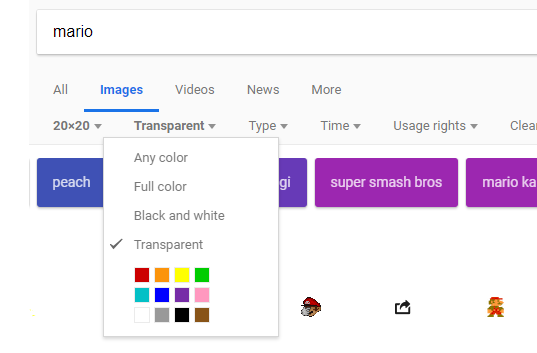

# Python Turtle Games

For these projects, we talked through code elements as a class for v1 and v2 and then students worked more independently for v3 and v4.
Most of us are using [trinket.io](https://trinket.io/)
I have two students that prefer IDLE, but every once in a while we notice slight differences in the two (for example, with trinket.io you can hold down an arrow key and continuously move, but with IDLE you must repeatedly press the arrow key).

## Turtle Game v1
Here is a student project for v1.0

We originally had a requirement that you had to collect the coin, delete the coin, and then touch the goal. Once the player distance to the coin was below a mininum, we would delete coin, but this would case an error when the code looped around and once again tried to determine the distance to the coin. We used try/except to handle this, but some of the students struggled with try/except, so I modified the project so that there is no goal and you simply have to touch the coin to win v1.

#### V1 Details

Create a simple game using turtle objects. Must have the following...

1.	One controllable sprite.

2.	Have a "forever loop." Use while True:
```python
while True:
```
3.	Have one or more enemies that follow player. Use enemy.setheading(enemy.towards(player))
```python
enemy.setheading(enemy.towards(player))
```
4.	Have one or more collectible items (like coins). These could be turtles with the "circle" shape.

5.	Have one goal. This could be a turtle with the "square" shape.

6.	If you touch an enemy, change the screen's background color and break the loop. Use player.distance(enemy) < 20 to detect if touching enemy.
```python
player.distance(enemy) < 20
```
7.	If you touch the coin, change the screen's background color to green and break the loop.

## Turtle Game v2
Here is a student's v2

Some students kept it really simple with Turtles named p1, p2, bad1, bad2, coin, and goal. Other students created arrays of badguys and arrays of coins. It was much easier to delete a coin from an array and not worry about getting an error.

#### V2 Details
Once you're finished with Turtle game v1.0... **DUPLICATE YOUR GAME, rename it v2**, and add the following features...

1.	Create a player2 turtle that is controlled with WASD (or if you want, you can make WASD player 1 and arrow keys player 2)

2.	Create a turtle called writer. Hide it and put its pen up.

3.	Create a function called writeScore(). In this function, have writer clear previous writing ( writer.clear() ), go to one corner, write the score for player 1, go to a different corner, write the score for player 2.

4.	Create one or more enemies that will follow player 2. In other words... you'll have enemies that chase p1 and different enemies that chase p2.

5.	Update your previous code so that if player 1 touches a coin player 1 gets a point, but if player 2 touches a coin player 2 gets a point. Make the same sort of update so that either player can die if touched by an enemy. Make the same sort of update so that either player can win if they have a high enough score and touch the goal.

## Turtle Game v3
Here is a student's v3

Some games switched back to a single player, but others stayed 2-player. The core idea with v3 is that the game resets when you reach the goal and gets progressively harder each time (adding more enemies and speeding up the game slightly).

#### V3 Details
Once you're finished with Turtle game v2.0... **DUPLICATE YOUR GAME, rename it v3.**

You have much more freedom with this game. You can go back to a 1 player game or keep it 2 players (co-operative or competitive), get rid of the following enemies or keep them, and get rid of the coins or change how coins work. The only requirements are the ones listed below.

Here are the required features...

1.	Create a function called reset() and use it to add MORE enemies, reset enemy locations, reset the player location, reset coins, etc. Do NOT reset scores.
2.	MUST increase the speed of the game with each level. Players and enemies will move forward slightly faster each round. You should probably make players turn faster too.
3.	Players and enemies cannot go out of bounds. If they do... they either wrap around, change their heading, or reset the level. Your choice.
4.	Create one or more "guards." A guard will follow a set route (for example, walking back and forth next to the goal) and will kill either player if it touches them.

## Turtle Game v4
Here is one student's v4 = ( Use WASD to move )


Here is another v4


We added a Wall class and images.

#### V4 Details
You have tons of freedom with this game. 1 player or 2p co-operative or 2p competitive? Enemies or no enemies? Following enemies or guards or both? Goal or coins or both? Multiple levels or only one level?

You *might* want to change the controls (or not). You can continue using Turtle controls (rotate left, rotate right, move forward). You could use RPG controls so that W changes your y position by +5, S is y - 5, A is x - 5, and D is x + 5. You could use platformer controls so that W changes your yvelocity + 5, A is x - 5, D is x + 5, and if not touching a wall/platform then yvelocity -= 0.1.

The only requirements are the ones listed below:

1.	Create a multi-line comment at the top of you code with your name, date, and directions. Your directions must explain the way to win OR way to make it to the next level. For example... reach the goal without dying OR reach the goal before the other player OR collect more coins than the other player OR collect all of the coins without dying. 
2.	Add a new file, name it wall.py, and copy/paste THIS CODE. Use the Wall class to create 1 or more walls/platforms.
3.	Your player(s) and enemies cannot walk through walls/platforms.
4.	Use an image in the background. <https://blog.trinket.io/using-images-in-turtle-programs/>
5.	Use images for all of your sprites (no more boring trianges/squares/etc) <https://blog.trinket.io/using-images-in-turtle-programs/> Hint: search for images with the Exact Size 20x20 (or Exact Size 32x32) and Color Transparent

